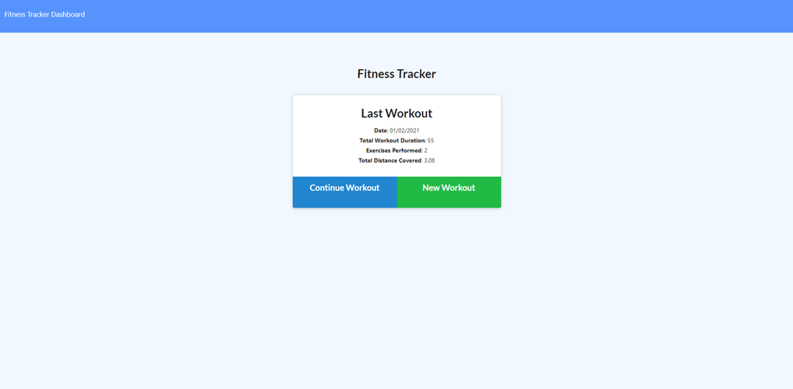

# Workout Tracker

 
 
 

## Description

This project is a back-end project and database creation for a **provided front-end** application. 

The project is a workout tracker that uses Mongo database with a Mongoose schema and routing handled by Express.
A consumer will reach their fitness goals more quickly when they track their workout progress.

**Important**: I did not create the front end code.    
I have however commented the javascript to find out how the front end was built so i could create the appropriate routing. 

### User Story
As a user, I want to be able to view create and track daily workouts. I want to be able to log multiple exercises in a workout on a given day. I should also be able to track the name, type, weight, sets, reps, and duration of exercise. If the exercise is a cardio exercise, I should be able to track my distance traveled.

When the user loads the page, they are given the option to create a new workout or continue with their last workout.

The user can then:

  * Add exercises to the most recent workout plan.

  * Add new exercises to a new workout plan.

  * View the combined weight of multiple exercises from the past seven workouts on the `stats` page.
  * View the total duration of each workout from the past seven workouts on the `stats` page.

### What I have learnt

During this project I have learnt that careful checking of the provided application is essential for an easy connection to the back end, keeping naming consistent so that all fields line up and work fluidly. I have learnt to writ persistent data to a NoSQL database. 

When I started the database construction, I worked in a very SQL based design structure with a table for each type of workout (Cardio and resistance) that were then associated with the workouts table. This proved unnecessary with MongoDB and a single table was needed to store multiple unknown instances of exercises. 
 

## Contents: 
1. [Installation](#Instalation) 
2. [Usage](#Usage)
3. [Improvements](#Improvements)
4. [Updates](#Updates)
5. [Credits](#Credits)
6. [License](#License)
7. [Contact](#Contact)

## Instalation

* Step 1: Download the zip file of the project.
* Step 2: Install the npm dependencies to your machine using first `>npm init`, then `>npm install <package name>`.

### Project dependencies

* Node.js
* Express
* MongoDB
* Mongoose
* dotenv

### Technologies 

Languages I have used are:
* Javascript

## Usage

### Developer

* Step 1: The application once downloaded will be invoked by using the following command in your command-line or terminal: `>node app.` 
* Step 2: You can utilise nodemon by running the command from your terminal `>npm run dev`

### User
The user can choose to create a new work out, this will be saved in the database under a new unique _id and the current date. 

The user can then add to an existing exercise choosing from Cardio or resistance and inputting There data into guided simple input fields. 

This data is displayed on the Dashboard page in 4 various charts. 

The application is deployed to [Heroku](https://fitness-tracker-slw-17.herokuapp.com/).

## Improvements

There is nothing to display at this time.

## Updates 

There is nothing to display at this time.
    
## Credits 

Resources I have referenced:   
* docs.mongodb.com
* mongoosejs.com

## License 

* GNU GPL v3   

Where appropriate: 
Alot of the graphics included in my projects I have drawn myself and are copyright 2020. 
No useage without permission. 
If I have not originated the imagery I have gained the permission of the owner and acreditied 
where necessary. These are also not for re-purpose without permission of the owner.

You must make reference where the code originated. I would also love to see what changes and improvements you make.  
Design by Samantha Wakelam, please respect copyright 2020. 

## Contact

* Name: Samantha Wakelam   Email: sam.wakelam@hotmail.co.uk  Github Profile: Sam Wakelam 